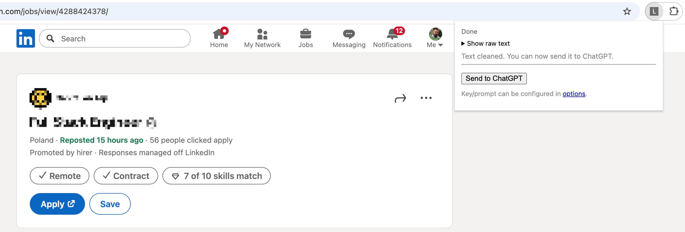
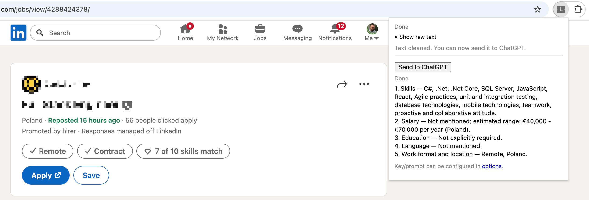
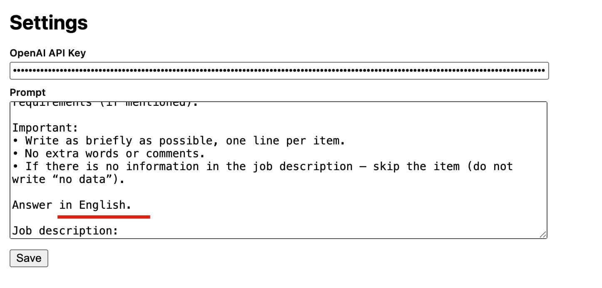

# LinkedIn Job Scraper & Summarizer (Chrome Extension)

Quickly grab job descriptions from LinkedIn and send them to ChatGPT for instant summaries.



---

## Features
- One-click scraping — grab LinkedIn job descriptions instantly
- Clean text — removes tags, line breaks, and junk formatting
- ChatGPT integration — send job details with your custom prompt
- Configurable — store API key & prompt in extension settings or provide a `prompt.txt`
- Local & safe — no backend, works fully in your browser  

---

## How It Works
1. Install extension locally (`Load unpacked` via `chrome://extensions`)
2. Open a job posting on LinkedIn
3. Click the extension icon → popup appears
4. See the scraped & cleaned job description
5. Hit “Send to ChatGPT” → get structured summary back  



---

## Setup

```bash
git clone https://github.com/anton-ds/linkedin-scraper-ext
```

1.	Open chrome://extensions/
2.	Enable Developer Mode
3.	Click Load unpacked and select the folder
4.	Open extension Options → enter your OpenAI API key and prompt (alternatively, place prompt.txt in the root folder)



## Example Prompt:

```text
I will send you a job description text.
Your task is to make a short summary in a strictly structured form (numbered list):
1. Skills — key technologies, programming languages, experience, soft skills (only from the text).
2. Salary — specify if mentioned. If not, estimate the range based on the market/country.
3. Education — only if explicitly required.
4. Language — level/requirement, if mentioned.
5. Work format and location — office/hybrid/remote, country/city, citizenship requirements (if mentioned).

Important:
• Write as briefly as possible, one line per item.
• No extra words or comments.
• If there is no information in the job description — skip the item (do not write “no data”).

Answer in English.

Job description:
```

## Author

[Anton Dolganin](https://www.linkedin.com/in/antonds/)

## License

MIT — free to use, hack, and share.
